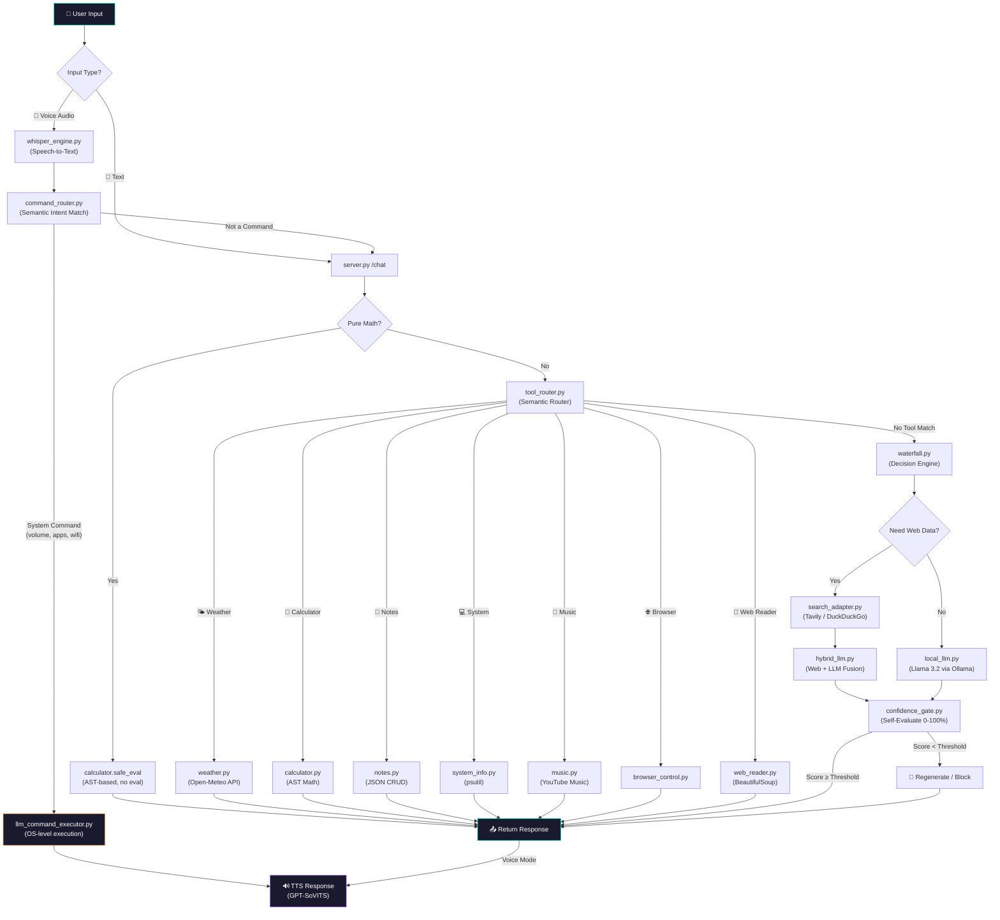
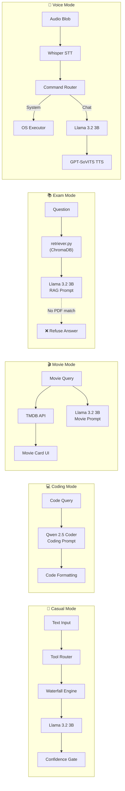
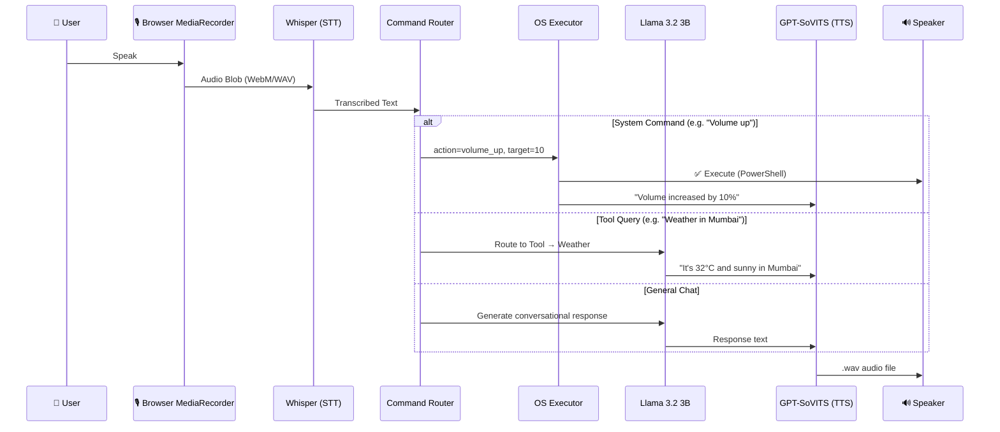
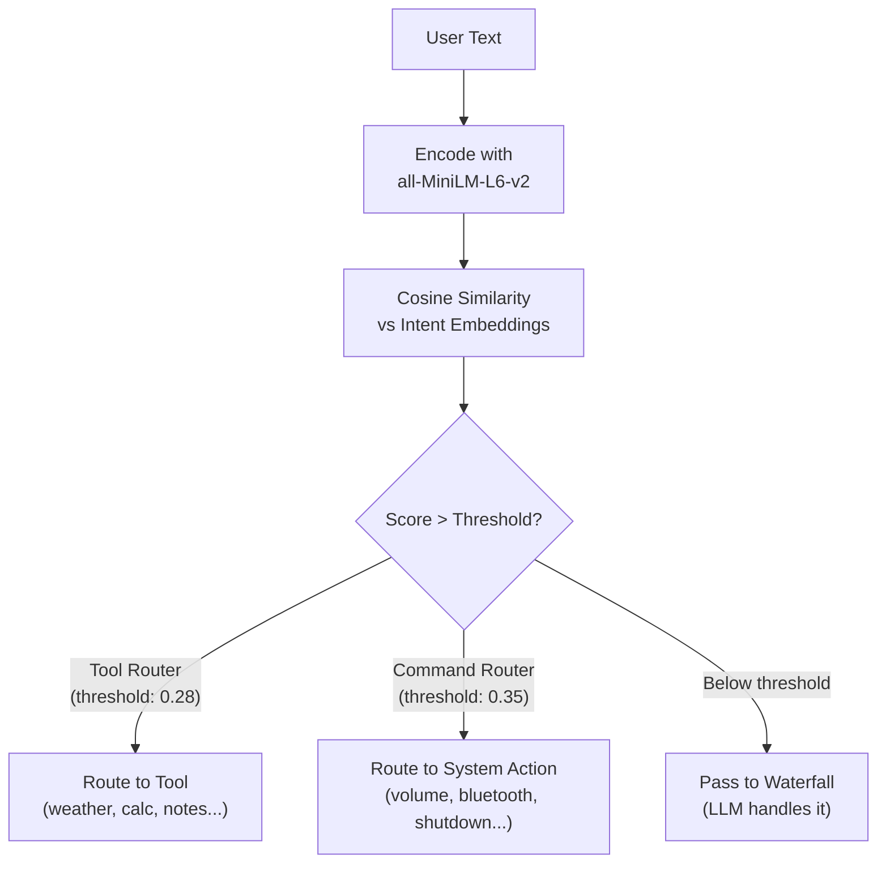
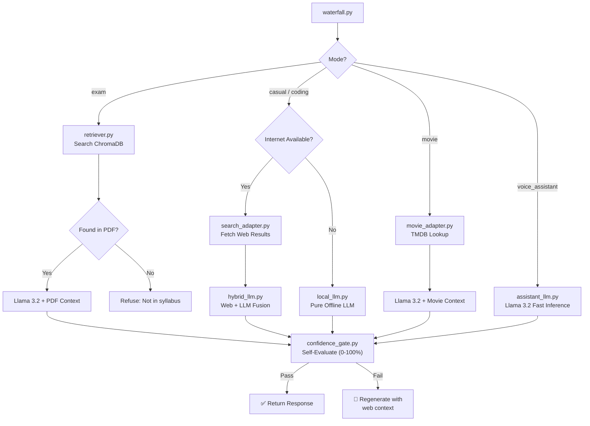
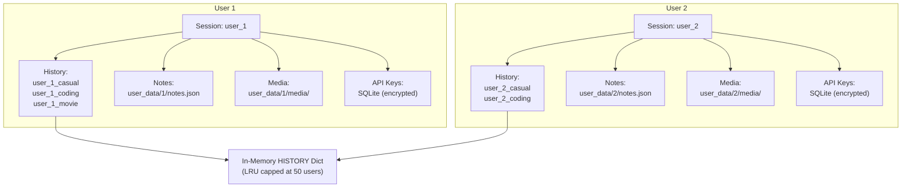
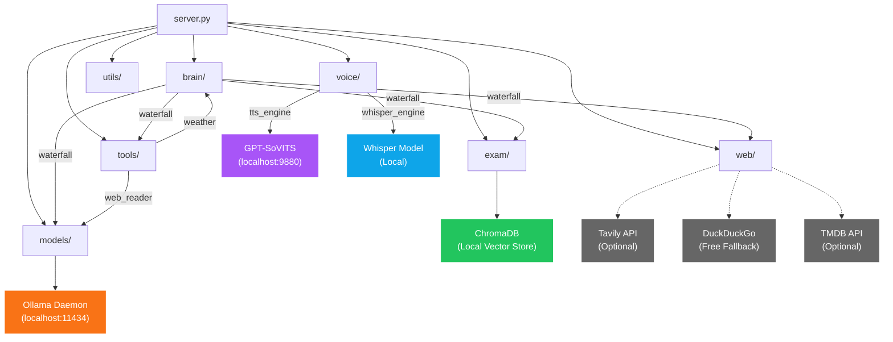

# NeonAI V5 — Technical Documentation

> **Local-First AI System** with Mode-Driven Intelligence, Voice Assistant, Tool Calling & Confidence Gating.

---

## 1. System Overview

NeonAI is an **offline-first AI system** where the LLM is one node in a larger decision pipeline — not the decision-maker. The system routes queries through tools, web search, and confidence gates before ever touching the LLM.

### Core Principles

| Principle | Implementation |
|:---|:---|
| **System > Model** | Waterfall engine decides the path, LLM only generates when needed |
| **Offline-First** | Runs 100% on localhost via Ollama — no cloud APIs required |
| **Mode Isolation** | Each mode (casual, coding, movie, exam, voice) has its own history, rules, and tools |
| **Tool-First** | Weather, calculator, notes, etc. respond in <1s without LLM |
| **Confidence Gating** | AI self-evaluates every answer (0-100%) and blocks hallucinations |

---

## 2. Technology Stack

### Backend

| Component | Technology | Purpose |
|:---|:---|:---|
| Server | **Flask** (Python 3.10+) | HTTP API, session management, routing |
| Auth | **SQLite** + **Werkzeug PBKDF2** | User accounts with hashed passwords |
| Sessions | **Flask Sessions** (HTTPOnly) | Secure per-user state isolation |
| CORS | **Flask-CORS** | Locked to localhost origins |

### AI / ML Models

| Model | Engine | Purpose | Size |
|:---|:---|:---|:---|
| **Llama 3.2 3B** | Ollama (local) | Text chat, voice assistant, reasoning | ~2 GB |
| **Qwen 2.5 Coder** | Ollama (local) | Coding mode (dedicated code model) | ~4 GB |
| **Whisper Base** | OpenAI Whisper (local) | Speech-to-Text (STT) | ~150 MB |
| **GPT-SoVITS** | Local API server | Text-to-Speech (TTS) voice cloning | ~1 GB |
| **all-MiniLM-L6-v2** | SentenceTransformers | Semantic intent routing (tools + commands) | ~80 MB |

### Data Storage

| Store | Technology | Purpose |
|:---|:---|:---|
| User Auth | SQLite (`user_data/auth/neon_users.db`) | Accounts, API keys |
| Movie Cache | SQLite (`user_data/cache/movie_cache.db`) | TMDB result caching |
| Exam Vectors | ChromaDB (local) | PDF embeddings for RAG |
| Notes | JSON files (`user_data/{id}/notes.json`) | Per-user notes |
| Memory | In-memory dict | Chat history per user+mode |

### External APIs (Optional)

| API | Purpose | Required? |
|:---|:---|:---|
| **Open-Meteo** | Weather data (free, no key) | No |
| **TMDB** | Movie details, trailers, recs | Optional (key in settings) |
| **Tavily** | Premium web search | Optional (key in settings) |
| **DuckDuckGo** | Free web search fallback | No |

---

## 3. Complete Request Flow

---

## 4. Mode Architecture

---

## 5. Voice Assistant Pipeline

---

## 6. Semantic Router (Tool & Command Detection)

NeonAI uses **SentenceTransformers** (`all-MiniLM-L6-v2`) for intent classification instead of keyword matching.

**How it works:**
1. Each tool/command has a list of example sentences (intents)
2. All example sentences are pre-encoded into embeddings at startup
3. User text is encoded and compared via cosine similarity
4. Highest-scoring intent above threshold wins

---

## 7. Waterfall Decision Engine

---

## 8. Data Flow & User Isolation

---

## 9. Module Dependency Map

> **Solid lines** = always used. **Dashed lines** = optional/internet-dependent.

---

## 10. Security Architecture

| Layer | Protection |
|:---|:---|
| **Authentication** | PBKDF2 hashed passwords, min 8 chars |
| **Sessions** | HTTPOnly cookies, rotation on login, 30-day expiry |
| **Authorization** | All write/reset endpoints require valid `session['user_id']` |
| **Math Evaluation** | Safe AST parser (no `eval()`) |
| **CORS** | Locked to `localhost:5000` and `127.0.0.1:5000` |
| **Data Isolation** | Per-user directories, per-user notes, per-user pending commands |
| **Database** | All SQLite connections use `try/finally` (no leaks) |
| **Secrets** | `NEON_SECRET` loaded from `.env` (never hardcoded) |

---

## 11. API Endpoints

| Method | Endpoint | Auth | Purpose |
|:---|:---|:---|:---|
| GET | `/` | No | Serve main chat UI |
| GET | `/login` | No | Serve login page |
| POST | `/auth/signup` | No | Register new account |
| POST | `/auth/login` | No | Login + session rotation |
| GET | `/auth/logout` | Yes | Clear session |
| POST | `/chat` | Yes | Main chat endpoint (all modes) |
| POST | `/voice` | Yes | Voice transcribe + respond |
| POST | `/upload-bg` | Yes | Upload background media |
| POST | `/upload-voicebg` | Yes | Upload voice mode video |
| POST | `/upload-dp` | Yes | Upload profile picture |
| POST | `/upload-pdf` | Yes | Upload exam PDF |
| POST | `/reset-exam-db` | Yes | Clear exam vector store |
| POST | `/reset` | Yes | Clear chat history |
| POST | `/set-search-key` | Yes | Save Tavily API key |
| POST | `/set-tmdb-key` | Yes | Save TMDB API key |
| GET | `/health` | No | System status (Ollama, TTS, internet) |

---

*Generated: March 2026 • NeonAI V5*
