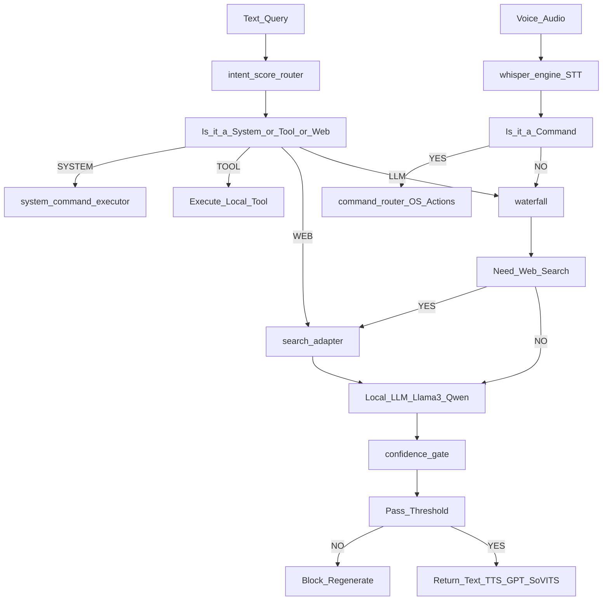

<div align="center">
  <h1>NeonVoice-Core</h1>
  <strong>Core repository for NeonAI</strong>
  <br>
  Local-first AI assistant with mode-based routing, tool calling, voice control, and a Flask web UI.
  <br><br>

  
  
  
  
</div>

> [!IMPORTANT]
> NeonVoice-Core powers NeonAI with scored routing across tools, web lookup, local LLM flows, and voice assistant features.

## Quick Snapshot

| Area | Highlights |
| --- | --- |
| Core AI | scored routing, confidence gate, local-first pipeline |
| Modes | casual, coding, movie, exam, voice assistant |
| Tools | weather, notes, calculator, browser, music, web reader |
| Stack | Flask, Ollama, Whisper, ChromaDB, GPT-SoVITS |

## Showcase

<p align="center">
  
</p>

> [!TIP]
> Add your next two screenshots later by replacing the placeholder URLs below.

<details>
<summary>Two-screenshot showcase block</summary>

```md
<table>
  <tr>
    <td width="50%" align="center">
      <strong>Main Chat UI</strong>
      <br><br>
      
    </td>
    <td width="50%" align="center">
      <strong>Voice Assistant / Mode View</strong>
      <br><br>
      
    </td>
  </tr>
</table>
```

</details>

## Overview

NeonVoice-Core powers NeonAI and routes requests through a small local AI system instead of sending everything straight to a single model.

- direct tools for weather, notes, calculator, browser actions, system info, and music
- scored routing between system commands, tools, web lookup, and local LLM generation
- separate modes for chat, coding, movies, exam/RAG, and voice assistant behavior
- local-first operation with Ollama, Whisper, and optional GPT-SoVITS

## Features

### Modes

- `casual`: general chat with tool-first routing and optional web lookup
- `coding`: coding-focused responses using a dedicated code model
- `movie`: TMDB-powered movie cards, recommendations, and summaries
- `exam`: PDF-only retrieval mode backed by ChromaDB
- `voice_assistant`: speech input, command routing, and TTS output

### Built-in tools

- weather
- calculator and conversions
- system information
- notes
- browser and search control
- webpage reader
- music lookup and YouTube handoff

## Quick Start

```powershell
python -m venv .venv
.venv\Scripts\activate
pip install -r requirements.txt
Copy-Item .env.example .env
python server.py
```

Required local services:

- Install [Ollama](https://ollama.com/)
- Pull `llama3.2:3b`
- Pull `qwen2.5-coder`

Optional voice setup:

- install GPT-SoVITS
- set `GPT_SOVITS_DIR` or explicit GPT-SoVITS model paths in `.env`

Open `http://localhost:5000`

## Repo Hygiene

This repo intentionally keeps local-only files out of GitHub:

- `.env` and private tokens
- `user_data/` databases, uploads, notes, and runtime files
- local embedding cache files under `models/embeddings/`
- temp audio, test artifacts, and editor caches

If the local embedding cache is missing, NeonAI now falls back to the official `sentence-transformers/all-MiniLM-L6-v2` model name so clones do not need your local cache committed to GitHub.

## Testing

```powershell
python -m pytest -q
```

## Legacy Notes

<details>
<summary>Open the original project write-up</summary>

<div align="center">

  

  <br><br>

  <h3>⚡ Local-First AI System with Voice Assistant & Tool Calling</h3>

  <p>
    
    
    
    
    
    
  </p>

  <p><b>Mode-Driven Intelligence • Voice Assistant • Tool Calling • Privacy Focused</b></p>

  <br>

  

</div>

</details>

<br>

---

## 🧠 What Is NeonAI?

**NeonAI V5** is a fully local AI system with mode-driven intelligence, tool calling, voice assistant, and a premium UI — running entirely on your machine.

> ⚠️ **This is not a chatbot wrapper.**  
> NeonAI is an AI *system* — with modes, rules, confidence gates, tool calling, memory, voice control, and decision pipelines. The LLM is a component, not the decision-maker.

---

## ✨ What Makes NeonAI Different

| Principle | Description |
|:---|:---|
| 🧠 **System > Model** | AI logic governs the LLM, not the other way around |
| 🔒 **Privacy First** | Everything runs locally — your data never leaves your machine |
| 🎯 **Mode-Driven** | Each mode has its own rules, memory, tools, and constraints |
| 🧭 **Scored Router** | Deterministic routing (system/tool/web/LLM) with confidence + guards |
| 🧩 **Clarification Layer** | N-best routing asks when top-2 intents are close |
| 🧠 **Context Memory Router** | Follow-ups like “pause” resolve correctly using recent context |
| 🛠️ **Tool Calling** | Real tools (weather, calculator, browser, notes, music) — instant, no LLM needed |
| 🎤 **Voice Control** | Full voice assistant with system commands, TTS, and tool access |
| 🔐 **Secure** | Session-isolated users, hashed passwords, safe math eval, auth-guarded endpoints |
| 🧪 **Experimental** | Built to explore controlled AI design, not to be a product |

---

## 🎮 Modes

<table>
<tr><td width="160"><b>🤖 NEON AI</b></td><td>General chat with smart web search + local LLM hybrid. Calculator & weather tools built-in.</td></tr>
<tr><td><b>💻 NEON CODE</b></td><td>Copy-paste ready code generation. Auto-switches from casual on coding intent.</td></tr>
<tr><td><b>🎬 NEON MOVIES</b></td><td>Trending carousel, movie details with genres/director/trailer/recommendations via TMDB.</td></tr>
<tr><td><b>📚 NEON STUDY</b></td><td>PDF-based RAG pipeline. Internet blocked. If the answer isn't in the PDF → AI refuses.</td></tr>
<tr><td><b>🎤 VOICE ASSISTANT</b></td><td>Full voice control — talk to Neon, use tools, control your PC. 20+ command types.</td></tr>
</table>

> 💡 Each mode has **isolated chat history** — switching modes keeps each mode's conversation separate.

---

## 🛠️ Tool Calling

NeonAI has built-in tools that respond **instantly** without waiting for the LLM. Tool routing uses a **Semantic Router** (SentenceTransformers) for natural-language intent matching + actionability gates to reduce false triggers.

Tool calls also return structured data for the UI:

```json
{
  "type": "tool",
  "tool": "weather",
  "action": "get_weather",
  "args": { "city": "Delhi" }
}
```

| Tool | Trigger Examples | Available In |
|:---|:---|:---|
| 🌤️ **Weather** | "Weather in Delhi", "Temperature in New York" | Chat + Voice |
| 🧮 **Calculator** | "Calculate 25 × 4 + 10", "Convert 100 km to miles" | Chat + Voice |
| 💻 **System Info** | "Battery level", "RAM usage", "CPU status" | Chat + Voice |
| 📝 **Notes** | "Save note: buy groceries", "Show my notes" | Chat + Voice |
| 🌐 **Web Reader** | "Read this https://example.com" | Chat + Voice |
| 🎵 **Music** | "Top 10 songs", "Play Drake", "Recommend some hip-hop" | Chat + Voice |
| 🔍 **Browser** | "Search on YouTube", "Google machine learning" | Chat + Voice |

```
User: "Weather in Delhi"
  → Semantic Router detects intent → weather tool
  → Instant response: 🌤️ 28°C, Partly Cloudy
  → No LLM call needed (< 1 second)
```

---

## 🎤 Voice Assistant

Talk to Neon using **Whisper** (STT) + **Llama 3.2** (brain) + **GPT-SoVITS** (TTS).

<table>
<tr><td><b>Category</b></td><td><b>Examples</b></td></tr>
<tr><td>🖥️ Apps</td><td>"Open Chrome", "Launch Spotify", "Open VS Code"</td></tr>
<tr><td>🌐 Web</td><td>"Open YouTube", "Go to GitHub"</td></tr>
<tr><td>🔍 Search</td><td>"Search Python tutorials", "Google the news"</td></tr>
<tr><td>▶️ YouTube</td><td>"Play lofi music on YouTube"</td></tr>
<tr><td>🎵 Media</td><td>"Pause", "Next song", "Stop music"</td></tr>
<tr><td>🔊 Volume</td><td>"Volume up", "Set volume to 50", "Mute"</td></tr>
<tr><td>💡 Brightness</td><td>"Increase brightness", "Set brightness to 70"</td></tr>
<tr><td>📶 Connectivity</td><td>"Turn on Bluetooth", "WiFi off", "Airplane mode"</td></tr>
<tr><td>⚡ System</td><td>"Shutdown", "Restart", "Lock screen", "Sleep"</td></tr>
<tr><td>🌤️ Tools</td><td>"What's the weather?", "System info", "Save a note"</td></tr>
</table>

---

## 🏗️ Architecture



---

## 🎨 Premium UI Features

- 🚀 **Animated Splash Screen** — Spinning ring, progress bar, "NEON AI" reveal on startup
- 🎨 **15+ Neon Themes** + Light/Dark mode with physics-based liquid toggle
- 💬 **Rich Message Rendering** — Bold, headers, numbered lists as glass cards, rating badges
- 📊 **Confidence Scoring Badges** — AI self-evaluates (0-100%) and displays a confidence metric badge under every answer
- 🎥 **Voice Customization** — Upload your own looping background video for the Voice UI panel
- 🖼️ **Wallpaper Upload (Image/Video)** — Drag & drop + progress bar + remove button
- 📦 **Upload Limits** — Background video up to **50MB**, image up to **10MB**
- 🎵 **Music Cards** — Rich, clickable YouTube-linked gradient cards natively rendered in chat
- 📋 **Code Blocks** — Syntax highlighted with copy-to-clipboard button
- 🌐 **Web Source Icons** — Favicon pills show which websites sourced the answer
- 🎬 **Movie Detail Cards** — Genre tags, director, runtime, trailer button, recommendation carousel
- 🎙️ **Draggable Voice Button** — GSAP Draggable, saves position
- 📱 **Fully Responsive** — Desktop + Mobile

---

## 📂 Project Structure

```text
NeonAI/
│
├── server.py                  # Flask backend + API routing + /health endpoint
├── START_NEON.bat             # One-click launcher (Windows)
├── .env                       # Environment config (NEON_SECRET, NGROK_TOKEN)
│
├── brain/                     # Core AI logic
│   ├── waterfall.py           # Decision flow & smart routing
│   ├── intent_score_router.py # Deterministic scored routing + N-best clarification
│   ├── router_state.py        # Per-user clarification + context memory state
│   ├── confidence_gate.py     # Hallucination control (0-100%)
│   ├── gk_engine.py           # General knowledge evaluation
│   └── memory.py              # Session & preference memory
│
├── models/                    # LLM layer
│   ├── local_llm.py           # Llama 3.2 (chat) + Qwen 2.5 (coding) via Ollama
│   ├── hybrid_llm.py          # Web + LLM fusion
│   └── assistant_llm.py       # Llama 3.2 (voice) via Ollama
│
├── tools/                     # Tool Calling System (Semantic Router)
│   ├── tool_router.py         # SentenceTransformer intent detection
│   ├── weather.py             # Weather via Open-Meteo (free, no key)
│   ├── calculator.py          # Safe AST math + unit conversions
│   ├── system_info.py         # CPU/RAM/disk/battery/GPU
│   ├── notes.py               # Thread-safe CRUD notes (JSON)
│   ├── music.py               # YouTube Music search + curated lists
│   ├── web_reader.py          # Fetch & summarize URLs
│   └── browser_control.py     # Google/YouTube/URL opener
│   └── vision_offline.py      # Offline resume/image analysis via Ollama vision + PDF extraction
│
├── voice/                     # Voice Assistant
│   ├── whisper_engine.py      # Speech-to-text (Whisper)
│   ├── tts_engine.py          # Text-to-speech (GPT-SoVITS) — env-configurable
│   ├── command_router.py      # Semantic NLP → action routing (per-user state)
│   ├── llm_command_executor.py # System command execution (volume, apps, etc.)
│   ├── model_loader.py        # Voice model management — env-configurable
│   └── reference_loader.py    # TTS reference audio — env-configurable
│
├── exam/                      # NEON STUDY (PDF RAG)
│   ├── indexer.py             # PDF → ChromaDB vector indexing
│   └── retriever.py           # Strict PDF-only retrieval
│
├── web/                       # Web adapters
│   ├── search_adapter.py      # Tavily / DuckDuckGo
│   └── movie_adapter.py       # TMDB (genres, trailer, recs)
│
├── utils/                     # Utilities
│   ├── auth_db.py             # SQLite auth (hashed passwords, try/finally)
│   ├── movie_db.py            # Movie cache (SQLite, try/finally)
│   ├── network.py             # Internet policy & connectivity check
│   └── storage_paths.py       # Centralized path management
│
├── scripts/                   # Dev tools
│   ├── command_tester.py      # Test command routing
│   ├── edge_case_tester.py    # Test edge cases
│   ├── generate_flow.py       # Generate architecture diagram
│   └── movie_updater.py       # Batch movie cache updates
│   └── add_one_line_headers.py # Bulk-add one-line file purpose headers
│
├── tests/
│   └── test_routing.py        # Pytest test suite
│   └── test_false_triggers.py # Regression tests for routing false triggers
│
├── templates/
│   ├── index.html             # Main chat UI
│   └── login.html             # Authentication page
│
└── static/
    ├── app.js                 # Frontend logic (1500+ lines)
    ├── styles.css             # Premium styling (2500+ lines)
    └── wallpapers/            # Custom backgrounds
```

---

## ▶️ Quick Start

### Requirements

**Software:**
- Python 3.10+
- [Ollama](https://ollama.com/) installed and running
- Models: `ollama pull llama3.2:3b` + `ollama pull qwen2.5-coder`
- (Optional) [GPT-SoVITS](https://github.com/RVC-Boss/GPT-SoVITS) for voice TTS

**Hardware:**
- **CPU**: Multi-core processor (Intel i5/Ryzen 5 or better)
- **RAM**: Minimum 8GB (16GB recommended)
- **GPU** (Optional): NVIDIA GPU with 6GB+ VRAM for Whisper & GPT-SoVITS acceleration
- **Storage**: Minimum 10GB free (SSD preferred)

### Install & Run

```bash
pip install -r requirements.txt
python server.py
```

**Or double-click** `START_NEON.bat`

**Open:** `http://localhost:5000`

### Health Check

Visit `http://localhost:5000/health` to verify system status (Ollama, TTS, Internet).

### Optional API Keys (in Settings ⚙️)
- **TMDB** — Movie posters, details, recommendations
- **Tavily** — Higher quality web search (free tier available)

### Environment Variables (`.env`)

| Variable | Purpose | Required |
|:---|:---|:---|
| `NEON_SECRET` | Flask session signing key | ✅ (auto-generated default) |
| `NGROK_TOKEN` | ngrok tunnel for remote access | Optional |
| `TTS_REF_AUDIO` | Custom TTS reference audio path | Optional |
| `GPT_SOVITS_GPT_MODEL` | GPT-SoVITS GPT model path | Optional |
| `GPT_SOVITS_SOVITS_MODEL` | GPT-SoVITS SoVITS model path | Optional |

---

## 🔐 Security

- ✅ **No `eval()`** — Math uses safe AST-based evaluation
- ✅ **Hashed passwords** — PBKDF2 via Werkzeug
- ✅ **Auth-guarded endpoints** — All write/reset routes require login
- ✅ **Session rotation** — Regenerated on login to prevent fixation
- ✅ **HTTPOnly cookies** — Session cookies not accessible via JavaScript
- ✅ **CORS locked** — Only localhost origins accepted
- ✅ **Per-user isolation** — Separate history, notes, media, and pending commands

---

## ✅ Check Code (Sanity Checks)

Run these from the project root:

```bash
python -m compileall -q .
python -m pytest -q
```

---

## 🧪 Status

- ✅ Multi-mode AI system with isolated history
- ✅ Semantic Router tool calling (weather, calculator, notes, system, browser, music, web reader)
- ✅ Deterministic scored routing (system/tool/web/LLM) + N-best clarification + context memory
- ✅ Structured tool outputs (`tool_data`) for UI/voice
- ✅ Voice assistant with 20+ command types and Smart Browser Control
- ✅ Premium UI with splash screen, 15+ themes, animations, microinteractions
- ✅ Confidence Gate scoring (0-100% evaluation metric)
- ✅ Smart web search + local LLM hybrid
- ✅ Movie mode with trailer, genres, recommendations
- ✅ Code blocks syntax highlighted with copy-to-clipboard button
- ✅ Rich markdown rendering (lists, headers, ratings)
- ✅ Ollama lazy reconnect (auto-recovers if started late)
- ✅ Thread-safe notes and SQLite connection management
- ⚠️ Experimental — Architecture locked for iteration

---

## 🚀 Future Enhancements

1. **Vision (Realtime camera)**: Webcam/screenshot analysis
2. **Long-Term Vector Memory**: Cross-session preference/knowledge memory
3. **Autonomous Agents**: Chained multi-tool workflows (search → summarize → save to notes)

---

## ⚠️ Disclaimer

This is an **experimental project** built for learning, research, and AI system design exploration. Not a commercial product.

---

<div align="center">

  <h3>🧠 Built by Ansh</h3>

  <i>B.Tech CSE</i>

  <br><br>

  <b>AI Systems • Voice Assistants • Tool Calling • Offline-First Architecture</b>

  <br><br>

  <i>"NeonAI is not about how smart the model is. It's about how controlled, safe, and purposeful AI should be."</i>

</div>

</details>
